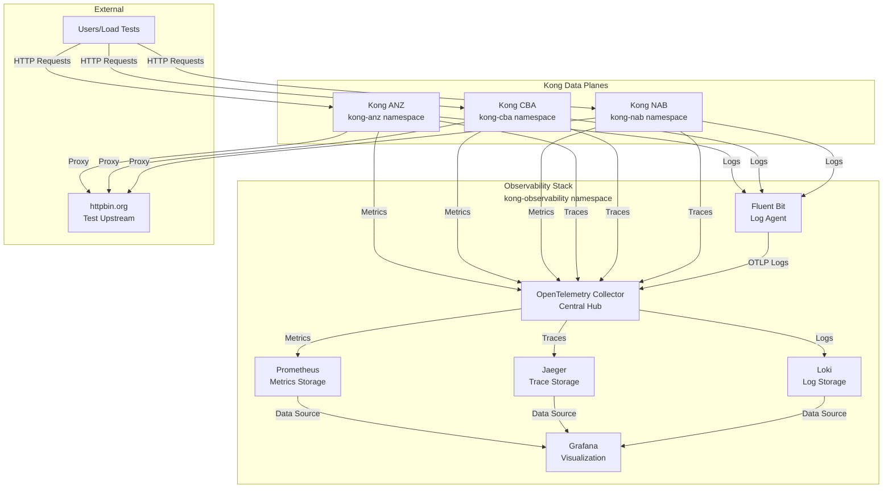

# Kong Observability Architecture

## Overview

This document describes the architecture of the Kong observability stack deployed via GitOps using ArgoCD.

## High-Level Architecture



## Component Details

### Kong Data Planes

Each Kong data plane runs in its own namespace with the following plugins configured:

#### Prometheus Plugin
- **Purpose**: Exposes Kong metrics on `/metrics` endpoint
- **Port**: 8100 (status port)
- **Metrics**: Request rates, latencies, error rates, upstream health

#### OpenTelemetry Plugin
- **Purpose**: Sends distributed traces to OTel Collector
- **Protocol**: OTLP over HTTP
- **Endpoint**: `http://otel-collector-opentelemetry-collector.kong-observability.svc.cluster.local:4318/v1/traces`
- **Data**: Request traces with spans, timing, and metadata

#### HTTP Log Plugin
- **Purpose**: Sends request logs to Fluent Bit
- **Protocol**: HTTP POST
- **Endpoint**: `http://fluent-bit.kong-observability.svc.cluster.local:2020`
- **Data**: Request/response logs with trace correlation

### OpenTelemetry Collector

Central telemetry processing hub with multiple pipelines:

#### Receivers
- **OTLP**: Receives traces and logs from Kong
  - gRPC: `:4317`
  - HTTP: `:4318`
- **Prometheus**: Scrapes metrics from Kong pods
  - Auto-discovery via Kubernetes service discovery
  - Targets Kong pods in `kong-anz`, `kong-cba`, `kong-nab` namespaces

#### Processors
- **Batch**: Batches telemetry data for efficient processing

#### Exporters
- **Prometheus**: Exposes metrics on `:8889` for Prometheus scraping
- **OTLP/Jaeger**: Forwards traces to Jaeger collector
- **OTLP/Loki**: Forwards logs to Loki

### Fluent Bit

Kubernetes-native log collection agent:

#### Input
- **Tail**: Collects all container logs from `/var/log/containers/*.log`
- **Kubernetes Filter**: Enriches logs with K8s metadata

#### Output
- **OpenTelemetry**: Sends logs to OTel Collector via OTLP
- **Trace Correlation**: Extracts trace/span IDs for correlation

### Storage Backends

#### Prometheus
- **Purpose**: Time-series metrics storage and alerting
- **Data Source**: OTel Collector metrics endpoint
- **Retention**: 15 days
- **Storage**: 10Gi persistent volume
- **Alert Rules**: Kong-specific monitoring rules

#### Jaeger
- **Purpose**: Distributed tracing storage and query
- **Data Source**: OTel Collector OTLP exporter
- **Storage**: In-memory (development setup)
- **UI**: Web interface for trace exploration

#### Loki
- **Purpose**: Log aggregation and storage
- **Data Source**: OTel Collector OTLP logs exporter
- **Storage**: Filesystem (development setup)
- **Query**: LogQL for log analysis

### Grafana

Unified observability dashboard:

#### Data Sources
- **Prometheus**: `http://prometheus-server.kong-observability.svc.cluster.local`
- **Loki**: `http://loki.kong-observability.svc.cluster.local:3100`
- **Jaeger**: `http://jaeger-query.kong-observability.svc.cluster.local:16686`

#### Features
- **Anonymous Access**: No authentication required
- **Pre-configured**: Data sources automatically configured
- **Dashboards**: Ready-to-use Kong monitoring dashboards

## Data Flow Patterns

### Metrics Flow
```
Kong Pods → OTel Collector (scrape) → Prometheus → Grafana
```

### Traces Flow
```
Kong Plugins → OTel Collector (OTLP) → Jaeger → Grafana
```

### Logs Flow
```
Kong Plugins → Fluent Bit → OTel Collector (OTLP) → Loki → Grafana
Container Logs → Fluent Bit → OTel Collector (OTLP) → Loki → Grafana
```

## Network Communication

### Service Discovery
- **Kong Metrics**: Kubernetes service discovery with label selectors
- **Cross-Namespace**: OTel Collector accesses Kong pods via RBAC

### Service Mesh
- **Internal**: All communication within cluster using service DNS
- **External**: Kong proxies to external upstreams (httpbin.org)

### Ports
- **Kong Proxy**: 8000 (HTTP), 8443 (HTTPS)
- **Kong Status**: 8100 (metrics endpoint)
- **OTel Collector**: 4317 (OTLP gRPC), 4318 (OTLP HTTP), 8889 (Prometheus)
- **Fluent Bit**: 2020 (HTTP input)
- **Prometheus**: 9090 (UI/API)
- **Grafana**: 3000 (UI)
- **Jaeger**: 16686 (UI)
- **Loki**: 3100 (API)

## Security Considerations

### RBAC
- **OTel Collector**: ClusterRole for cross-namespace pod access
- **Fluent Bit**: ClusterRole for log collection across all namespaces

### Network Policies
- **Default**: Allow all communication within observability namespace
- **Cross-Namespace**: Kong namespaces can reach observability services

### Authentication
- **Grafana**: Anonymous access enabled (development setup)
- **Other Services**: Internal cluster communication only

## Scalability

### Horizontal Scaling
- **OTel Collector**: Can be scaled as deployment
- **Fluent Bit**: DaemonSet ensures one pod per node

### Vertical Scaling
- **Resource Limits**: Configured for development workloads
- **Storage**: Persistent volumes for data retention

### Performance
- **Batching**: OTel Collector batches data for efficiency
- **Sampling**: Can be configured for high-volume environments

## Monitoring the Monitoring

### Health Checks
- **OTel Collector**: Health check endpoint on `:13133`
- **Fluent Bit**: Health check endpoint on `:2020`

### Self-Monitoring
- **Prometheus**: Monitors its own metrics
- **OTel Collector**: Exposes internal metrics
- **Grafana**: Built-in health monitoring

### Alerting
- **Kong Alerts**: Business logic monitoring
- **Infrastructure Alerts**: Component health monitoring